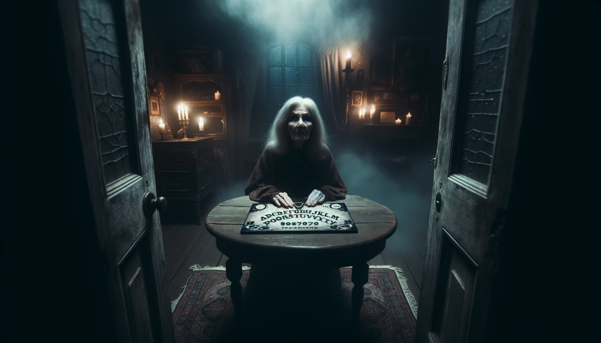
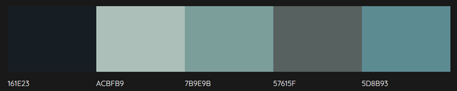

<h3>THIS TEMPLATE IS ONLY TO BE USED ON THE OCTOBER HACKATHON PROJECT</h3>
<h4>Please do not use it for the course project work</h4>
 
<h1 align="center"><strong>🎃🎃🎃 Phantom Forge: A Halloween Hackathon 🎃🎃🎃</strong>

</h1>

# SUBMISSION

## Deployment

#### _(please note, your team must also include the deployed links in the usual submission in Hackapp)_

The project is deployed and can be accessed at [http://your-deployed-link.com](http://your-deployed-link.com).

## Criteria

In this section, we will briefly discuss how our team addressed the applicable criteria:

- 🎃 Creative design that enhances user-experience
- 🎃 Project fits theme of Halloween
- 🎃 Responsive and accessible for different screen sizes
- 🎃 Project is well planned using Github Projects
- 🎃 Overall project focus is realistic and has a sense of completeness

# ABOUT SUBMISSION

## Intro

One or two paragraphs providing an overview of our project

## Goal

The goal section provides a concise summary of the main objective or purpose of the project or software described in this README. It addresses the following aspects:

- ➡️ Problem Statement
- ➡️ Objective(s)
- ➡️ Target Audience
- ➡️ Benefits

## Tech

In the tech section, we provide information about the technology stack, dependencies, and any technical details related to the project.

## Credits

In the credits section, we provide information about the sources used

<h1>GRIM REPOS GRIM MANOR PROJECT</h1>
## Intro

You are presented with the image of a dark mansion on a rain-soaked night. Text invites you to seek refuge and enter. 

Once indoors, a gloomy corridor with multiple doors greets you and a young, pale man appears. Your challenge is to complete a series of minigames to find clues as to what happened to the young man.

When you have completed the minigames, the clues you have gathered will tell the story of what happened to the young man and you will have completed the game!

## Goal

The goal section provides a concise summary of the main objective or purpose of the project or software described in this README. It addresses the following aspects:

- ➡️ Problem Statement

Create a website which fits the theme of Halloween; is responsive and accessible for different screen sizes and has a positive user-experience. 

- ➡️ Objective(s)

<i>-Creative design</i>

We based our colour scheme on an AI generated image of an Old Woman with Ouija board which is contained within the game…

The image is a representation of the feeling we want the game to inspire. The mist and soft-lighting from the candles have a slightly creepy and spooky undertone whilst not being too overtly frightening. The colour palette containing the soft hues of the blues and greens therefore reflect the eerie tones we are aiming whilst still creating enough of a contrast to be seen clearly by the user. 

We chose the font Risque as our base font:

This was because we felt that it was in-keeping with the style of an old-time mansion whilst also being easily legible and interesting to look at.
  

<i>Moving around</i>

On laptop/desktop, users will be able to click on the doors/stairs and access the mini-games. 

On tablet/mobile screens, simply shrinking the image would make it too small and give a poor user experience so users will be able to pan left and right within the mansion to be able to see the doors and then access the mini-games in the same way. 
  

- ➡️ Target Audience

We decided that our project would be spooky but not ‘scary’. This means that the website has a distinct Halloween feel but is accessible across a wider range of ages and temperaments. 

Although younger children might find the overall design of the website to be frightening, the mini-games themselves are accessible to children of approximately 8 years and up. 

The games have the ability to be replayed as, once the clues have been solved, the local memory will recognise this and allow the games to become standalone. 

- ➡️ Benefits

## Tech

In the tech section, we provide information about the technology stack, dependencies, and any technical details related to the project.

## Credits
<ul>
<li><a href="https://openai.com/dall-e-2">Dall-E</a> for AI generated images</li>
<li><a href="FontsBlogs.com">FontsBlogs.com for Ouija Font in Hangman game</li>
<li><a href="Balsamiq.com">Balsamiq</a> for wireframes</li>
<li><a href="Freesound.org">Freesound.org</a> for audio clips</li>
<li><a href-"https://fonts.google.com/">Google Fonts</a> for base font ‘Risque’</li>
<li><a href="https://obsproject.com/welcome">OBS</a> for screen recording software</li>

